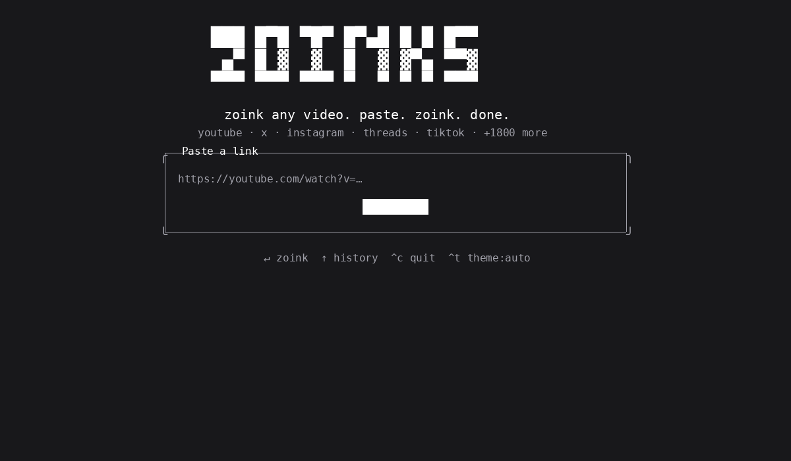

# zoinks (Python + Rust)

<picture>
  <source media="(prefers-color-scheme: dark)" srcset="assets/logo-dark.svg">
  
</picture>

**zoink any video. paste. zoink. done.**

A Python + Rust port of [Pablo Stanley's `yoinks`](https://github.com/pablostanley/yoinks) — the terminal video downloader that wraps [`yt-dlp`](https://github.com/yt-dlp/yt-dlp) and gives you a clean, full-screen picker for YouTube, X/Twitter, Instagram, Threads, TikTok and 1,800+ other sites.

This fork keeps the original UX (paste, pick a resolution or audio-only mp3, yoink) but splits the implementation across two languages:

* **Rust core** — yt-dlp orchestration, format/clipboard/history/platform helpers, the standalone `zoinks-tui` ratatui binary, and the PyO3 bindings that expose the same surface to Python.
* **Python TUI** — a [`textual`](https://textual.textualize.io/)-based UI that drives the Rust core via the `zoinks` Python package.

Both surfaces share the same Rust crate, so behaviour stays in lock-step: the same `probe` / `build_choices` / `download` calls underlie the Rust binary, the Python CLI, and any third-party Python code that imports `zoinks`.



---

## Install

### Python package (recommended — works on macOS / Linux / Windows)

```sh
pip install zoinks
```

Then:

```sh
zoinks                                  # prompts for a url
zoinks https://youtu.be/dQw4w9WgXcQ     # straight to the format picker
zoinks --theme dark                     # force the dark palette
python -m zoinks                        # equivalent
```

### Standalone Rust binary (no Python required)

Grab the prebuilt `zoinks-tui` binary from the [releases page](https://github.com/humair-m/zoinks/releases), or build it from source:

```sh
cargo build --release --no-default-features --bin zoinks-tui
# binary lands at target/release/zoinks-tui
./target/release/zoinks-tui https://youtu.be/dQw4w9WgXcQ
```

### Pre-built binaries

This repo's [releases page](https://github.com/humair-m/zoinks/releases) ships:

* `zoinks-tui-x86_64-unknown-linux-gnu` — standalone Linux x86_64 binary
* `zoinks-tui-aarch64-unknown-linux-gnu` — standalone Linux ARM64 binary
* `zoinks-tui-x86_64-apple-darwin` — standalone macOS Intel binary
* `zoinks-tui-aarch64-apple-darwin` — standalone macOS Apple Silicon binary
* `zoinks-tui-x86_64-pc-windows-gnu.exe` — standalone Windows binary
* `zoinks-<version>-py3-none-{manylinux,macos,win}.whl` — Python wheels

## Requirements

* **Python 3.8+** for the Python package (PyO3 builds with `abi3-py38`, so a single wheel works on every CPython 3.8+).
* **Rust 1.74+** only if you're building from source.
* **yt-dlp + ffmpeg** — **bundled inside the wheel and the standalone binary**. No first-run download needed. Both binaries (yt-dlp 39 MB + ffmpeg 58 MB) are embedded via `include_bytes!` and extracted to `~/.zoinks/bin/` on first use. Run `zoinks --update` to refresh the bundled yt-dlp to the latest release from GitHub.

## Usage

### From the terminal (TUI)

```sh
$ zoinks https://youtu.be/dQw4w9WgXcQ    # straight to the format picker
$ zoinks                                 # prompts for a url
$ zoinks --theme light                   # force the light palette
$ zoinks --cookies cookies.txt <url>    # for X / Facebook / Instagram
$ zoinks --update                        # update the bundled yt-dlp to latest
```

zoinks takes over the terminal (full-screen, centered — and restores your scrollback on exit). Pick a format with ↑/↓ (or j/k) and hit enter. `esc` goes back, `^c` quits. Files are saved to `~/Downloads`, and the file path is printed to your terminal when you're done.

The default `auto` theme uses your terminal's own foreground and background, so it follows light and dark terminal themes without guessing. Press `^t` to cycle through `auto`, `light`, and `dark` for the current session. Use `--theme auto`, `--theme light`, or `--theme dark` to choose the starting theme for one launch.

### When a URL fails — troubleshooting

| Error from yt-dlp | What it means | What to do |
|-------------------|---------------|------------|
| `Unsupported URL` | yt-dlp doesn't recognise the URL — usually your yt-dlp is too old (common with X's 19-digit snowflake IDs) | `zoinks --update` to refresh yt-dlp, then retry |
| `No video formats found` | yt-dlp got the page but couldn't extract media — usually needs login | `zoinks --cookies cookies.txt <url>` |
| `Requested format is not available` | none of our format selectors matched (rare; usually a yt-dlp quirk) | the picker's `best available` option always works; or `yt-dlp --list-formats <url>` |
| `login required` / `unable to extract` | site requires authentication | `zoinks --cookies cookies.txt <url>` |

Cookies files must be in Netscape format. Use a browser extension like [Get cookies.txt](https://chromewebstore.google.com/detail/get-cookiestxt-locally/bmhlcbfjnnmjdfbnbnllbdfjfhlnfndd) to export one.

If a download fails on the first attempt, **zoinks automatically retries once** with a fresh yt-dlp probe — the cached media URLs sometimes expire within minutes.

### As a Python library

The Rust core is exposed as a friendly Python API:

```python
from zoinks import Zoinks, default_out_dir

y = Zoinks()

# 1. yt-dlp is bundled inside the wheel — ensure_ytdlp() just extracts it
#    to ~/.zoinks/bin/ on first call. No network needed.
y.ensure_ytdlp(status_callback=lambda msg: print(msg))

# 2. probe a URL for media info — pass cookies for X / Facebook / Instagram
info = y.probe("https://youtu.be/dQw4w9WgXcQ")
# info = y.probe("https://x.com/u/status/123", cookies="cookies.txt")
print(info.title, info.duration, info.uploader)

# 3. build the resolution/audio picker choices
choices = y.build_choices(info)
for c in choices:
    print(c.kind, c.label, c.args)

# 4. download — pass an on_progress callback for live progress
filepath = y.download(
    "https://youtu.be/dQw4w9WgXcQ",
    choices[0],
    out_dir=default_out_dir(),
    info_json_path=info.info_json_path,   # skip re-extracting metadata
    cookies="cookies.txt",                # optional — for sites needing login
    on_progress=lambda p: print(f"{p['downloaded_bytes']}/{p['total_bytes']} bytes"),
    on_processing=lambda: print("merging…"),
)
print("saved to:", filepath)

# Update the bundled yt-dlp when you hit "Unsupported URL"
y.update_ytdlp()
```

### Top-level helpers

```python
import zoinks

zoinks.detect_platform("https://x.com/u/status/1")    # -> Platform(key="x", label="X / Twitter")
zoinks.is_probably_url("https://example.com")           # -> True
zoinks.read_clipboard()                                # -> str
zoinks.load_history()                                  # -> List[str]
zoinks.add_to_history("https://youtu.be/x")            # -> List[str]
zoinks.version()                                        # -> "0.4.1"
```

## Architecture

```
                 ┌──────────────────────────────────────┐
                 │            user-facing                │
                 │                                       │
   $ zoinks-tui ─┤─── Rust binary (ratatui)              │
                 │                                       │
   $ zoinks ─────┤─── Python textual TUI                  │
                 │           │                            │
                 │           v                            │
                 │     zoinks Python pkg (PyO3 wheel)    │
                 │           │                            │
                 └───────────┼────────────────────────────┘
                             v
                ┌─────────────────────────────────┐
                │   zoinks (Rust crate / cdylib)   │
                │   ──────────────────────────────  │
                │   • args     • format             │
                │   • theme    • platforms          │
                │   • history   • clipboard         │
                │   • ytdlp  (probe / download /     │
                │             ensure_yt_dlp /        │
                │             build_choices)        │
                └─────────────────────────────────┘
                             │
                             v
                       yt-dlp + ffmpeg
```

The whole crate is ~2,400 lines of Rust and ~600 lines of Python — small enough to read in one sitting. The TS original is ~1,800 lines; we add the cross-language surface, extra tests, and the `DownloadOpts` / `DownloadGuard` ergonomics the Rust API needs.

### Project layout

```
zoinks/
├── Cargo.toml              # Rust workspace (lib + bin + cdylib for PyO3)
├── pyproject.toml           # maturin config, Python packaging
├── README.md
├── LICENSE                  # MIT — same as upstream
├── CHANGELOG.md
├── CONTRIBUTING.md
├── src/                     # Rust source
│   ├── lib.rs               # crate root
│   ├── args.rs              # CLI parsing (mirrors src/lib/args.ts)
│   ├── format.rs            # byte / duration / path formatting
│   ├── platforms.rs         # host detection (YouTube, X, …)
│   ├── theme.rs             # auto/light/dark palettes
│   ├── history.rs           # ~/.config/zoinks/history.json
│   ├── clipboard.rs         # pbpaste / xclip / wl-paste / powershell
│   ├── ytdlp.rs             # ensureYtDlp / probe / buildChoices / download
│   ├── py.rs                # PyO3 bindings (the `Zoinks` Python class)
│   ├── tui/                 # ratatui-based standalone TUI
│   │   ├── mod.rs
│   │   ├── theme.rs
│   │   └── app.rs
│   └── bin/zoinks_tui.rs    # standalone binary entry point
├── python/zoinks/           # Python package
│   ├── __init__.py          # public re-exports
│   ├── __main__.py          # `python -m zoinks`
│   ├── core.py              # `from ._zoinks_core import …`
│   ├── args.py              # CLI parser (mirrors src/args.rs)
│   ├── cli.py               # `zoinks` console script
│   └── tui/
│       ├── __init__.py
│       └── app.py           # textual TUI
├── tests/                   # pytest suite
│   └── test_args.py
└── assets/                  # logo + screenshots (from upstream)
```

## Development

### Build

```sh
# Rust binary (no Python needed)
cargo build --no-default-features --bin zoinks-tui
cargo test --no-default-features --lib

# Python package (builds the PyO3 extension + ships python/)
maturin develop --release        # editable install in current venv
maturin build --release          # produces dist/zoinks-*.whl

# Run Python tests
pip install -e '.[dev]'
pytest tests/
ruff check python/zoinks/
```

### Release checklist

1. Bump `version` in `Cargo.toml` **and** `pyproject.toml` — they must match.
2. Update `CHANGELOG.md`.
3. `cargo test --no-default-features --lib && pytest tests/`
4. `maturin build --release` → upload `dist/zoinks-*.whl` to PyPI (`maturin publish`).
5. `cargo build --release --no-default-features --bin zoinks-tui` → upload `target/release/zoinks-tui` to GitHub Releases for each target (use `cross` or GitHub Actions matrix).

A GitHub Actions workflow that does all of the above on tag push lives in `.github/workflows/release.yml` (see the [Releases](https://github.com/humair-m/zoinks/releases) tab).

## How it works

- Powered by [yt-dlp](https://github.com/yt-dlp/yt-dlp) + [ffmpeg](https://ffmpeg.org/). Both are **bundled inside the binary** via `include_bytes!` and extracted to `~/.zoinks/bin/` on first use — no first-run download, no Python required for the Rust binary, no system yt-dlp/ffmpeg needed. Run `zoinks --update` to refresh the bundled yt-dlp to the latest release from GitHub.
- The Rust TUI uses [`ratatui`](https://ratatui.rs/) + [`crossterm`](https://github.com/crossterm-rs/crossterm). The Python TUI uses [`textual`](https://textual.textualize.io/).
- Both TUIs drive the same Rust core (`probe`, `build_choices`, `download`), so behaviour is identical across surfaces.

## Tested sites

End-to-end probe + download test results (yt-dlp 2026.08.19, no cookies):

| Site | Probe | Download | Notes |
|------|-------|----------|-------|
| X / Twitter | ✓ 4 choices | ✓ 1.2 MB | works out of the box |
| Facebook reels | ✓ 3 choices | ✓ 13.6 MB | works out of the box |
| Soundcloud | ✓ 2 choices | ✓ 464 KB | works out of the box (audio) |
| Streamable | ✓ 2 choices | ✓ 2.9 MB | works out of the box |
| YouTube | ⚠ bot wall | ⚠ use `--cookies-from-browser chrome` | YouTube blocks anonymous probes — same as original yoinks |
| Vimeo | ⚠ login required | ⚠ use `--cookies-from-browser` | site requires account |
| Reddit | ⚠ login required | ⚠ use `--cookies-from-browser` | Reddit started requiring login in 2024 |
| Instagram | ⚠ login required | ⚠ use `--cookies-from-browser` | site requires account |
| TikTok | ⚠ extractor flakiness | ⚠ try `--update` then retry | yt-dlp's TikTok extractor is fragile |

Run the test yourself: `python3 scripts/e2e_probe.py` and `python3 scripts/e2e_download.py`.

## Roadmap

- [x] Publish Python wheel + standalone Rust binary
- [x] PyO3 bindings exposing `Zoinks.probe / download / build_choices / ensure_ytdlp`
- [x] Theme switching (`auto` / `light` / `dark`)
- [x] Clipboard detection: launch bare and auto-suggest the url you copied
- [x] History (`~/.config/zoinks/history.json`, deduped, capped at 50)
- [ ] `--best` / `--mp3` flags to skip the picker (scriptable mode)
- [ ] `-o <dir>` to choose the output folder
- [ ] Playlist / thread-with-multiple-videos support
- [ ] Self-update for the bundled yt-dlp binary (`yt-dlp -U`)
- [ ] `curl yoinks.sh | sh` installer

## Acknowledgements

This is a port of [Pablo Stanley's](https://github.com/pablostanley) original `yoinks` TypeScript TUI. All credit for the design, tagline, and the lovely block-character logo goes to him. The original MIT license is preserved.

## A note on fair use

zoinks is a personal-archiving tool. Downloading content may violate a platform's terms of service — only download what you have the right to keep, and be excellent to creators.

## License

[MIT](LICENSE) — same as upstream.
